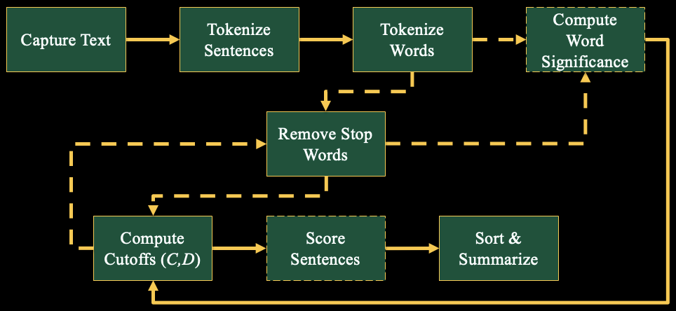

# Luhn Auto-Abstract
Implementation of Luhn paper from 1958.

Citation:
Luhn, Hans Peter. "The Automatic Creation of Literature Abstracts." __IBM Journal of Research and Development 2.2__ (1958): 159-165.


**luhn_abstract** is a Python module for automatically generating an abstract from a document using unsupervised techniques.  The Luhn paper was published in 1958, and the general concept of the algorithm is outlined in the diagram below.



# Dependencies
~~~~~~~~~~~~
luhn_abstract requires:

- Python (>=3.6)
- NumPy
- NLTK
- Pandas
~~~~~~~~~~~~

# Example

```python
import luhn_abstract as la
val_url = 'https://en.wikipedia.org/wiki/natural_language_processing'
val_text = scrape_page_wikipedia(val_url=val_url)
luhn_rtn = la.luhn_abstract.run_auto_summarization(val_text=val_text,
	is_print=True,
	func_stem_selected=la.luhn_abstract.tokenize_stem_nltk)
```

```
Quantile Significance Lower = 1
Quantile Significance Upper = 31
Machine learning approaches, which include both statistical and neural networks, 
on the other hand, have many advantages over the symbolic approach:  Although 
rule-based systems for manipulating symbols were still in use in 2020, they 
have become mostly obsolete with the advance of LLMs in 2023. [22.5000] [8] In 
2003, word n-gram model, at the time the best statistical algorithm, was 
outperformed by a multi-layer perceptron (with a single hidden layer and 
context length of several words trained on up to 14 million of words with a 
CPU cluster in language modelling) by Yoshua Bengio with co-authors. [18.0000] 
The premise of symbolic NLP is well-summarized by John Searle's Chinese room 
experiment: Given a collection of rules (e.g., a Chinese phrasebook, with 
questions and matching answers), the computer emulates natural language 
understanding (or other NLP tasks) by applying those rules to the data it 
confronts. [17.4222] As an example, George Lakoff offers a methodology to 
build natural language processing (NLP) algorithms through the perspective 
of cognitive science, along with the findings of cognitive linguistics,[50] 
with two defining aspects: Ties with cognitive linguistics are part of the 
historical heritage of NLP, but they have been less frequently addressed since 
the statistical turn during the 1990s. [16.2881]
```